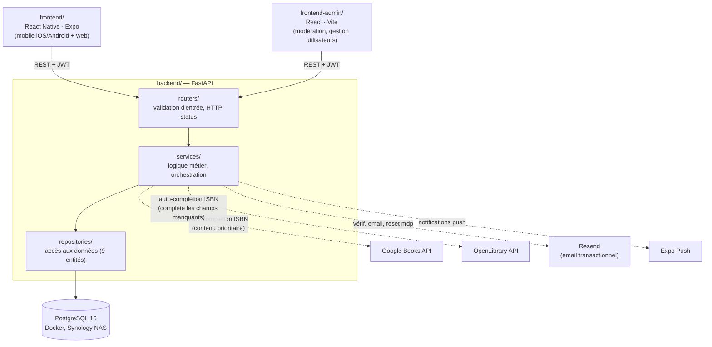
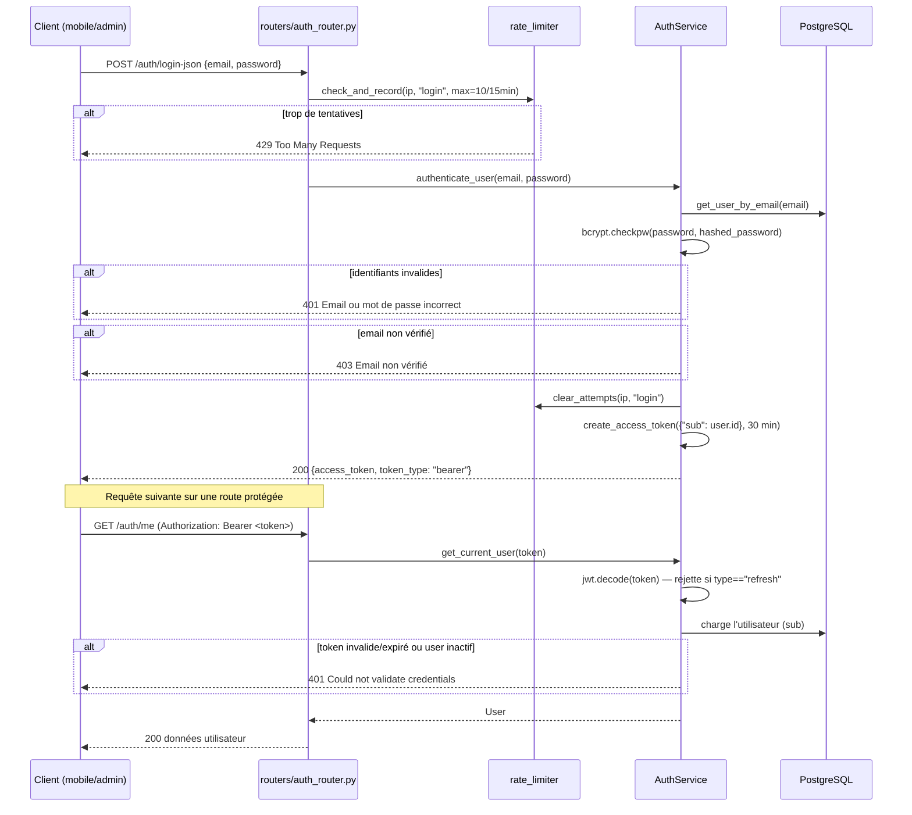
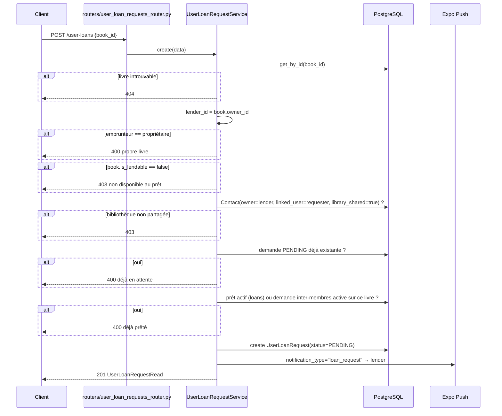
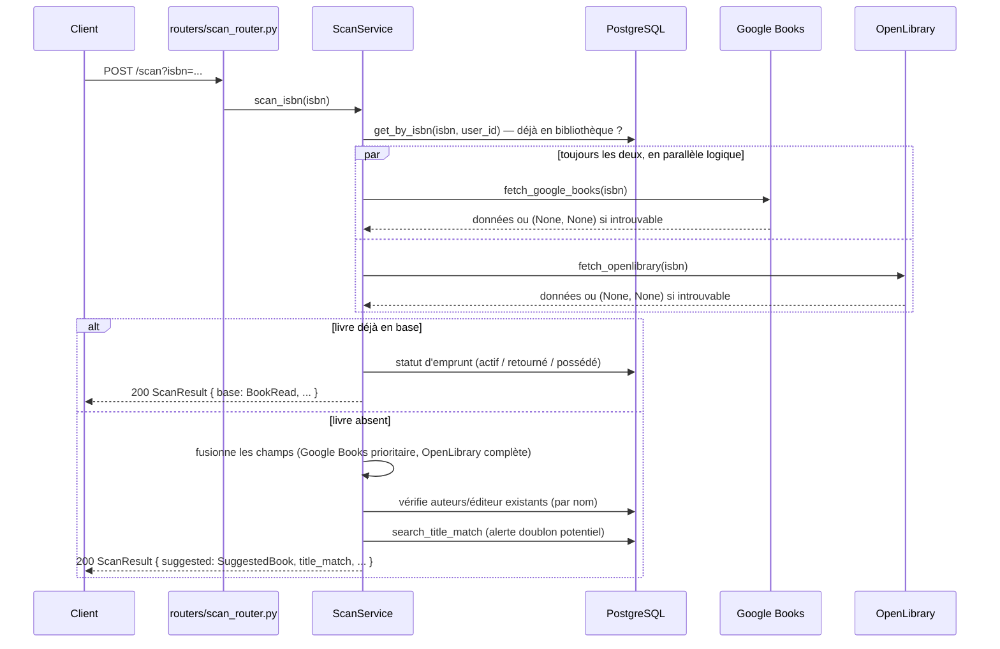

# Architecture technique

Vue d'ensemble technique du projet Bibliothèque2. Pour le détail du schéma de données, voir [schema_bdd.md](schema_bdd.md) et les vues par thème dans [schemas/](schemas/).

## Vue d'ensemble

Trois applications distinctes partagent une seule API backend :
- **`frontend/`** — l'app principale (mobile iOS/Android + web), React Native/Expo.
- **`frontend-admin/`** — panneau d'administration séparé (modération, gestion utilisateurs/whitelist/waitlist), React/Vite, déployé indépendamment.
- **`backend/`** — API REST FastAPI, seule à parler à la base de données.



Certaines entités (`users`, `reports`, `admin`, `contact_invitations`, `push_tokens`...) n'ont pas de repository dédié : leurs services/routers accèdent directement à la session SQLModel. Seules 9 entités au cœur du domaine (books, authors, publishers, genres, series, loans, borrowed_books, contacts, user_loan_requests) suivent le pattern complet routers → services → repositories.

## Flux clés

### Authentification (login + accès à une route protégée)



`POST /auth/login-json` ne renvoie qu'un access_token (30 min). Seul `POST /auth/login` (form OAuth2, utilisé par le flux "se souvenir de moi") génère aussi un refresh_token — 1 jour par défaut, 60 jours si `remember_me`, renouvelable via `POST /auth/refresh`.

### Demande d'emprunt entre utilisateurs



Suite du cycle de vie (mêmes garde-fous d'autorisation) : `accept`/`decline` réservés au `lender_id` (statut `PENDING` requis), `cancel` réservé au `requester_id`, `return_book` réservé au `lender_id` (statut `ACCEPTED` requis). Seuls `accept`/`decline` déclenchent une notification push (`loan_accepted`/`loan_declined`).

### Scan ISBN (pré-remplissage du formulaire, sans création en base)



`scan_isbn()` ne fait aucune écriture en base : il retourne toujours un `ScanResult` (potentiellement avec `title=None` et des messages d'erreur si aucune des deux APIs ne trouve l'ISBN), à charge du frontend de pré-remplir un formulaire que l'utilisateur valide via `POST /books`.

## Backend (`backend/app/`)

### Organisation en couches

```
routers/        # endpoints FastAPI — validation d'entrée, appel des services, HTTP status
services/        # logique métier, règles de validation, orchestration
repositories/     # accès aux données (requêtes SQLModel/SQLAlchemy)
models/          # tables SQLModel (source de vérité du schéma)
schemas/         # schémas Pydantic (contrats d'entrée/sortie API, distincts des models)
clients/         # clients HTTP vers les APIs externes (Google Books, OpenLibrary)
config/          # configuration (whitelist, constantes)
admin/           # setup optionnel de sqladmin (panneau admin FastAPI, désactivé par défaut)
utils/           # rate limiter, helpers transverses
```

Pas de couche repository pour toutes les entités : certains services (ex. `reports`, `admin`) accèdent directement à la session SQLModel pour des opérations simples. Les entités au cœur du domaine (books, authors, loans, contacts...) suivent le pattern complet router → service → repository.

### Points d'entrée notables

- **`app/main.py`** — assemble l'app FastAPI : middlewares (headers de sécurité, logging des requêtes, CORS), 23 routers, migrations Alembic exécutées automatiquement au démarrage (`lifespan`), scheduler de rappels de prêts lancé en tâche de fond.
- **`app/db.py`** — moteur SQLAlchemy (pool de connexions PostgreSQL), import de tous les modèles pour peupler `SQLModel.metadata`.
- **Documentation interactive** — `/docs` (Swagger) et `/redoc`, désactivés automatiquement en production (`ENV=production`).

### Domaines fonctionnels (routers)

| Domaine | Routers |
|---|---|
| Catalogue | `books`, `authors`, `publishers`, `genres`, `series`, `covers`, `scan` |
| Auth & compte | `auth`, `users`, `account` |
| Prêts | `loans`, `borrowed_books`, `user_loan_requests` |
| Réseau | `contacts`, `contact_invitations` |
| Notifications | `push_tokens`, `notifications` |
| Import | `import_jobs` (traitement asynchrone de CSV en masse) |
| Modération / admin | `reports`, `admin`, `admin_entities` |
| Public | `contact_staff`, `waitlist` |

### Intégrations externes

- **Google Books API** et **OpenLibrary** — auto-complétion des métadonnées lors du scan ISBN (`app/clients/`). Les deux APIs sont systématiquement interrogées ; les champs de Google Books sont prioritaires, complétés par OpenLibrary quand un champ manque (pas un simple repli séquentiel).
- **Resend** — envoi d'emails transactionnels (vérification d'email, reset de mot de passe) via `app/services/email_service.py`.
- **Expo Push** — notifications push mobile (`app/services/push_notification_service.py`), avec préférences par type d'événement stockées en JSON sur `users.push_prefs` (voir [schemas/notifications.md](schemas/notifications.md)).

### Tâches de fond

Un scheduler (`app/services/reminder_scheduler.py`) tourne en boucle (toutes les 24h) dans le process FastAPI et envoie des rappels push 48h avant l'échéance des prêts actifs — pas de worker/queue séparé, tout est in-process.

### Panneau admin FastAPI (optionnel)

`app/admin/setup.py` configure [sqladmin](https://aminalaee.dev/sqladmin/), activable via `SQLADMIN_ENABLED=true`. C'est un panneau générique CRUD sur les modèles bruts, distinct de `frontend-admin/` qui offre des vues métier (modération, whitelist) au-dessus de l'API.

## Frontend mobile/web (`frontend/`)

Expo Router (navigation par fichiers), TypeScript. Structure :

```
app/             # pages/écrans (routing par arborescence de fichiers)
components/       # composants réutilisables
services/          # un fichier par domaine, appels API (fetch + JWT)
contexts/          # AuthContext, ThemeContext, NotificationsContext
hooks/            # hooks personnalisés
types/            # types TypeScript partagés
```

Cible mobile (iOS/Android, build EAS) et web (déployé comme site statique) depuis la même base de code.

## Panneau admin (`frontend-admin/`)

React + Vite + TanStack Query + Tailwind, appli séparée avec son propre build et déploiement (`redeploy-admin.ps1`). Pages : Dashboard, Books, Users, Loans, Entities (fusion doublons), Reports, Whitelist, WaitlistEntries, AuditLog.

## Base de données

PostgreSQL 16, un seul schéma `public`, migrations Alembic appliquées automatiquement au démarrage du backend (`alembic upgrade head` dans `lifespan`). Voir [schema_bdd.md](schema_bdd.md) pour le détail des 22 tables et leurs relations, avec vues par thème documentant aussi les règles métier invisibles dans un ERD classique (enums applicatifs, machines à états, contraintes composites).

## Sécurité

JWT (access + refresh token), bcrypt pour les mots de passe, whitelist d'inscription (table admin, repli `.env`), rate limiting anti brute-force persistant en base, validation stricte des entrées (Pydantic + règles métier), headers de sécurité HTTP (CSP, HSTS, X-Frame-Options). Détail complet : [backend/SECURITY.md](../backend/SECURITY.md).

## Déploiement

Images Docker construites et poussées sur Docker Hub, déployées sur un NAS Synology via SSH (`scripts/deploy/`). Le mobile est distribué via EAS (build + OTA update). Voir [scripts/README.md](../scripts/README.md) pour le détail des scripts, et [docs/PRODUCTION_SETUP.md](PRODUCTION_SETUP.md) / [docs/STAGING_SETUP.md](STAGING_SETUP.md) pour l'infrastructure (non versionnés publiquement, contiennent des détails d'infra).

## Versionnage

Le numéro de version affiché aux utilisateurs (changelog in-app) vit dans [docs/CHANGELOG.json](CHANGELOG.json) — c'est la source de vérité produit, mise à jour manuellement à chaque entrée de changelog.

`scripts/deploy/bump-version.ps1` gère un numéro distinct : celui de `frontend/app.config.js` (utilisé pour `MIN_APP_VERSION` / le build mobile), qu'il ne synchronise pas avec `CHANGELOG.json`. Au moins quatre numéros de version coexistent dans le repo et ne sont pas synchronisés entre eux : `frontend/package.json` (`1.0.0`), `frontend/app.json` (`1.0.0`), `frontend/app.config.js` (`1.0.7`, géré par `bump-version.ps1`), `app.main:app` côté FastAPI (`0.1.0`), et `docs/CHANGELOG.json` (`1.4.1`, la référence produit). Ne pas utiliser les quatre premiers comme indicateur de la version réelle de l'app.
