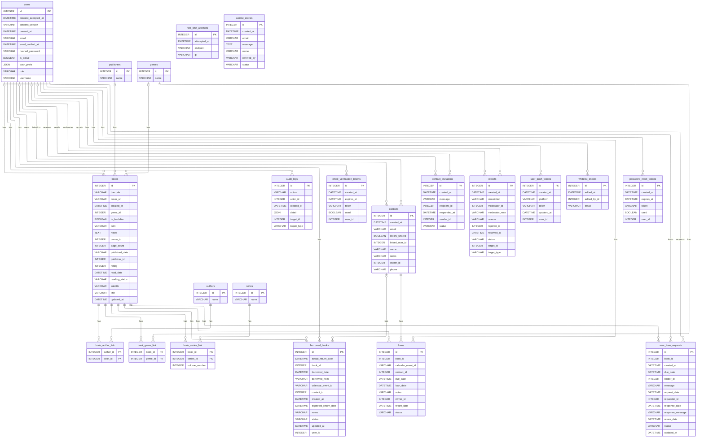

# Schéma de base de données

Ce diagramme est généré automatiquement à partir des modèles SQLModel du backend
(`backend/app/models/`) via [eralchemy2](https://github.com/Alexis-benoist/eralchemy2).
Il reflète le schéma réel de la base PostgreSQL, pas une version figée dans le temps.

Pour des vues plus lisibles par thème (avec les règles métier et contraintes
absentes d'un simple diagramme de colonnes) :

- [Schéma — Catalogue (livres, auteurs, éditeurs, genres, séries)](schemas/catalogue.md)
- [Schéma — Utilisateurs & sécurité](schemas/utilisateurs.md)
- [Schéma — Emprunts & prêts](schemas/emprunts.md)
- [Schéma — Contacts & invitations](schemas/contacts.md)
- [Schéma — Modération & administration](schemas/moderation.md)
- [Schéma — Notifications push](schemas/notifications.md)

## Régénérer ce diagramme

```bash
cd backend
pip install eralchemy2
python ../scripts/gen_schema_diagram.py
```

Le script importe tous les modèles pour peupler `SQLModel.metadata`, puis exporte
un bloc Mermaid `erDiagram` directement dans ce fichier (rendu nativement par GitHub,
sans dépendance à un service externe).

## Diagramme entité-relation



## Notes de lecture

- **`books`** est l'entité centrale : rattachée à un propriétaire (`owner_id` → `users`),
  un éditeur, un genre principal, et reliée en many-to-many aux auteurs (`book_author_link`),
  genres secondaires (`book_genre_link`) et séries (`book_series_link`).
- **Prêts** : le projet a deux mécanismes distincts —
  - `loans` / `borrowed_books` : suivi manuel des prêts consentis par le propriétaire (à un contact).
  - `user_loan_requests` : flux de demande d'emprunt entre utilisateurs de l'app (requester/lender),
    avec cycle de vie propre (demande → réponse → retour).
- **`contacts`** peut être lié à un compte utilisateur réel (`linked_user_id`) si la personne
  a aussi un compte sur l'app, sinon reste une fiche libre (nom/email/téléphone).
- **Tokens et sécurité** : `email_verification_tokens`, `password_reset_tokens` et
  `rate_limit_attempts` sont des tables techniques à durée de vie courte (purge possible après expiration).
- **Modération** : `reports` (signalements) et `audit_logs` (traçabilité des actions admin)
  soutiennent le panneau d'administration séparé (`frontend-admin/`).
