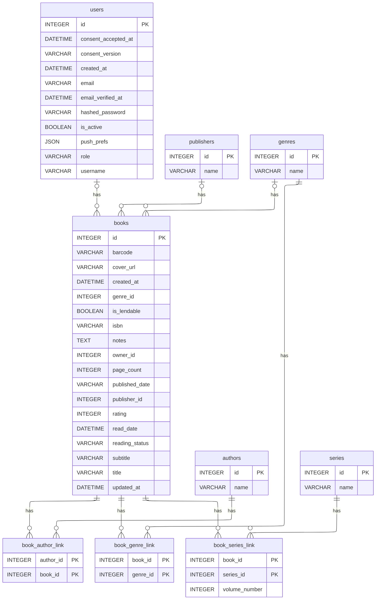

# Schéma — Catalogue (livres, auteurs, éditeurs, genres, séries)

Le cœur du catalogue : un livre appartient à un utilisateur, a un éditeur et un genre principal, et est relié en many-to-many aux auteurs, genres secondaires et séries.

[⬅ Retour au schéma complet](../schema_bdd.md)

## Contraintes et règles invisibles sur le diagramme

- **Unicité** : `books` est unique par `(title, isbn, owner_id)` — deux utilisateurs
  peuvent posséder le même livre, mais pas en double pour un même propriétaire.
  `authors.name`, `publishers.name`, `genres.name`, `series.name` sont en revanche
  **uniques globalement** (toutes bibliothèques confondues) : les livres de plusieurs
  utilisateurs partagent la même ligne auteur/éditeur/genre/série en base.
- **`books.reading_status`** est un `VARCHAR` en base mais un enum applicatif à 3
  valeurs (`read` / `unread` / `in_progress`, `backend/app/schemas/book_schemas.py`).
- **`books.rating`** : pas de contrainte SQL, mais borné 0–5 en validation applicative
  (`BookService._validate_rating`) ; `0` signifie "non renseigné".
- **`books.isbn`** : doit faire 10 ou 13 caractères une fois les tirets retirés
  (vérifié en code, pas en base).
- **`books.is_lendable`** (`default=True`) conditionne si le livre est proposable au
  prêt inter-membres (voir [emprunts.md](emprunts.md)).
- **Cascade** : supprimer un `Book` supprime en cascade ses `Loan` et `BorrowedBook`
  (cascade ORM SQLAlchemy, pas une contrainte `ON DELETE` en base).
- **Fusion d'entités** : le panneau admin permet de fusionner deux auteurs/éditeurs/
  genres/séries en doublon (réattribution des liens puis suppression de la source),
  tracé dans `audit_logs` (`action="merge_entity"`).
