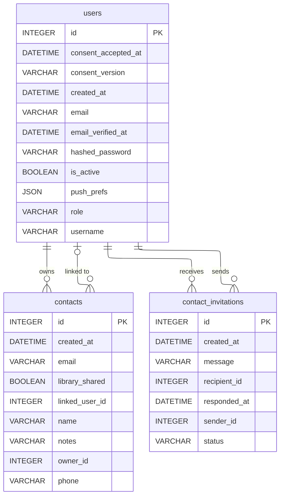

# Schéma — Contacts & invitations

Un contact peut être une fiche libre (nom/email/téléphone) ou être lié à un compte utilisateur réel via `linked_user_id`. Les invitations permettent à deux utilisateurs de se relier.

[⬅ Retour au schéma complet](../schema_bdd.md)

## Contraintes et règles invisibles sur le diagramme

- **Unicité** : `contacts` est unique par `(name, owner_id)` — le nom n'a besoin
  d'être unique que dans la bibliothèque d'un même propriétaire.
- **`library_shared`** ne peut être activé que si `linked_user_id` est déjà renseigné ;
  ce flag conditionne l'autorisation d'emprunt inter-membres.
- **Contact miroir bidirectionnel** : quand une invitation est acceptée, un `Contact`
  est créé automatiquement **des deux côtés** (chacun pointant vers l'autre via
  `linked_user_id`), pas juste une relation à sens unique.
- **Suppression protégée** : impossible de supprimer un contact ayant un prêt actif/en
  retard, ou une demande d'emprunt inter-membres acceptée. Si le contact est lié à un
  compte, ses demandes en attente sont auto-annulées et le contact miroir chez l'autre
  utilisateur est supprimé aussi.
- **`contact_invitations.status`** est un enum applicatif : `pending`, `accepted`,
  `declined`, `cancelled`. Auto-invitation interdite, une seule invitation `pending`
  possible entre deux utilisateurs (dans un sens ou l'autre), et impossible si les
  deux sont déjà liés.
