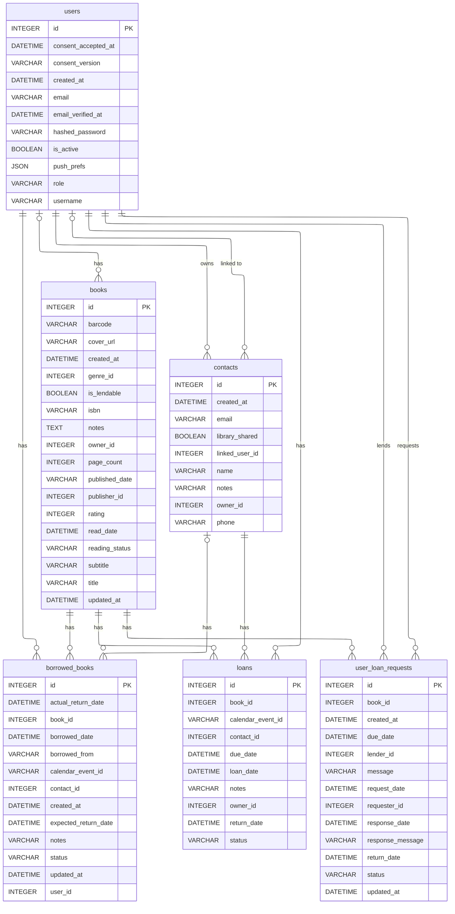

# Schéma — Emprunts & prêts

Deux mécanismes de prêt coexistent : `loans`/`borrowed_books` pour le suivi manuel des prêts consentis par le propriétaire à un contact, et `user_loan_requests` pour le flux de demande d'emprunt entre deux utilisateurs de l'app (requester/lender).

[⬅ Retour au schéma complet](../schema_bdd.md)

## Contraintes et règles invisibles sur le diagramme

- **`status` est un enum recalculé, pas une valeur figée** : `loans.status` et
  `borrowed_books.status` (`active`/`returned`/`overdue`) sont repassés de `active`
  à `overdue` **à chaque lecture** si la date d'échéance est dépassée (avec
  persistance immédiate) — ce n'est pas un flag qu'on met à jour manuellement.
  `user_loan_requests.status` a 5 valeurs : `pending`, `accepted`, `declined`,
  `cancelled`, `returned`.
- **Machine à états stricte sur `user_loan_requests`** : création refusée si le livre
  n'est pas `is_lendable`, si le prêteur n'a pas de `Contact` avec `library_shared=True`
  vers ce demandeur, ou si une demande `pending`/un prêt actif existe déjà sur ce
  livre. `accept`/`decline` réservés au `lender_id`, `cancel` au `requester_id`,
  toujours depuis `pending`. Le retour n'est possible que depuis `accepted`.
- **Exclusivité mutuelle** : un `Loan` classique et une `UserLoanRequest` acceptée ne
  peuvent pas coexister sur le même livre — chaque création vérifie l'absence de
  l'autre mécanisme actif.
- **Rappels automatiques** : un scheduler notifie par push 48h avant l'échéance des
  `Loan` et `UserLoanRequest` actifs — ce rappel n'a pas de `notification_type` et
  échappe donc au filtre `users.push_prefs` (voir [notifications.md](notifications.md)).
- **`borrowed_books.borrowed_from`** est un champ texte legacy conservé en parallèle
  de `contact_id` pour rétrocompatibilité.
