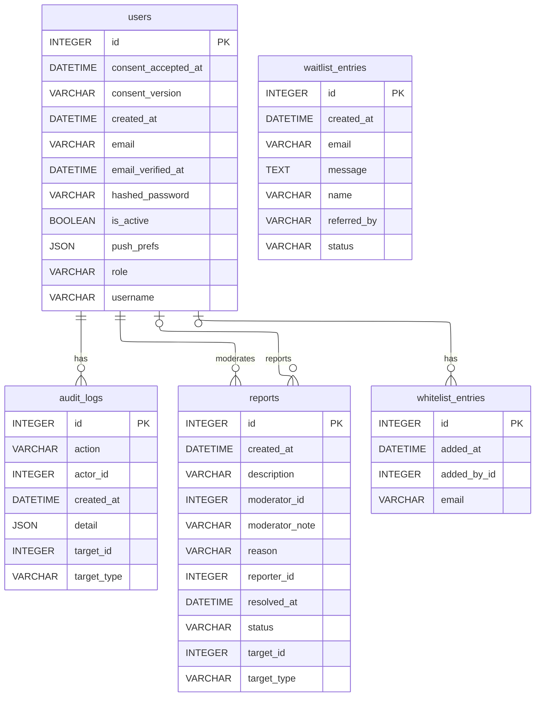

# Schéma — Modération & administration

Signalements (`reports`) et traçabilité des actions admin (`audit_logs`), plus les listes de contrôle d'accès (`whitelist_entries`) et la liste d'attente d'inscription (`waitlist_entries`). Support du panneau d'administration séparé (`frontend-admin/`).

[⬅ Retour au schéma complet](../schema_bdd.md)

## Contraintes et règles invisibles sur le diagramme

- **`reports`** a 3 enums applicatifs : `target_type` (`book`/`note`/`user`),
  `reason` (`inappropriate`/`spam`/`wrong_info`/`other`), `status`
  (`pending`/`resolved`/`rejected`, défaut `pending`).
- **`reports.target_id` est une référence polymorphe** : simple `INTEGER` sans FK
  réelle en base, résolu applicativement selon `target_type` — un signalement peut
  pointer vers un livre, une note ou un utilisateur déjà supprimé sans erreur SQL.
- **Résolution stricte** : un signalement ne peut passer que de `pending` à `resolved`
  ou `rejected`, toujours par un modérateur, jamais en sens inverse.
- **`audit_logs.action`** est une convention de code (pas un enum ni une contrainte
  CHECK) restreinte en pratique à : `suspend_user`, `delete_user`, `resolve_report`,
  `reject_report`, `merge_entity`, `change_role`, `whitelist_add`, `whitelist_remove`.
  La table est **append-only** : aucune route ne modifie ou supprime une entrée.
- **Droits d'accès** : lecture des signalements et actions courantes accessibles aux
  `moderator` et `admin` ; suppression de compte et gestion de la whitelist réservées
  aux `admin` uniquement.
