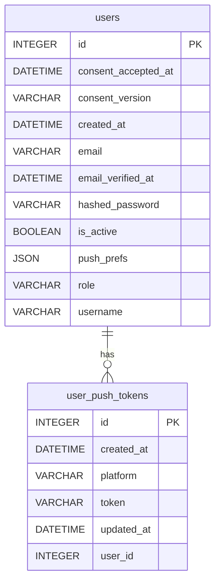

# Schéma — Notifications push

Un utilisateur peut enregistrer plusieurs tokens push (un par appareil/plateforme).

[⬅ Retour au schéma complet](../schema_bdd.md)

## `users.push_prefs`

Colonne JSON libre (pas de table dédiée) : `{type_evenement: bool}`, `true` par défaut
si la clé est absente. Utilisée pour désactiver certains types de notification sans
toucher aux tokens eux-mêmes.

Types d'événement actuellement émis par le backend (`_fire_push(..., notification_type=...)`) :

| Type | Émis par |
|------|----------|
| `contact_invitation` | Réception d'une invitation de contact |
| `contact_accepted` | Une invitation envoyée a été acceptée |
| `loan_request` | Réception d'une demande d'emprunt |
| `loan_accepted` | Une demande d'emprunt envoyée a été acceptée |
| `loan_declined` | Une demande d'emprunt envoyée a été refusée |

Exemple : `{"loan_request": false}` désactive uniquement les notifications de demande
d'emprunt, tout le reste reste actif par défaut.

**Cas particulier** : les rappels d'échéance à 48h (voir [emprunts.md](emprunts.md))
sont envoyés sans `notification_type` — ils ne sont donc **jamais filtrables** via
`push_prefs`, contrairement aux 5 types ci-dessus.

Autres contraintes non visibles sur le diagramme :
- `user_push_tokens.token` est unique en base.
- Un token doit commencer par `ExponentPushToken[` pour être utilisé à l'envoi (vérifié
  en code, pas en base) — les tokens mal formés sont ignorés silencieusement.
- La variable d'environnement `PUSH_NOTIFICATIONS_ENABLED` coupe l'envoi de toutes les
  notifications indépendamment de `push_prefs`.

API : `GET/PUT /push-tokens/prefs` (voir `backend/app/routers/push_tokens.py`).
