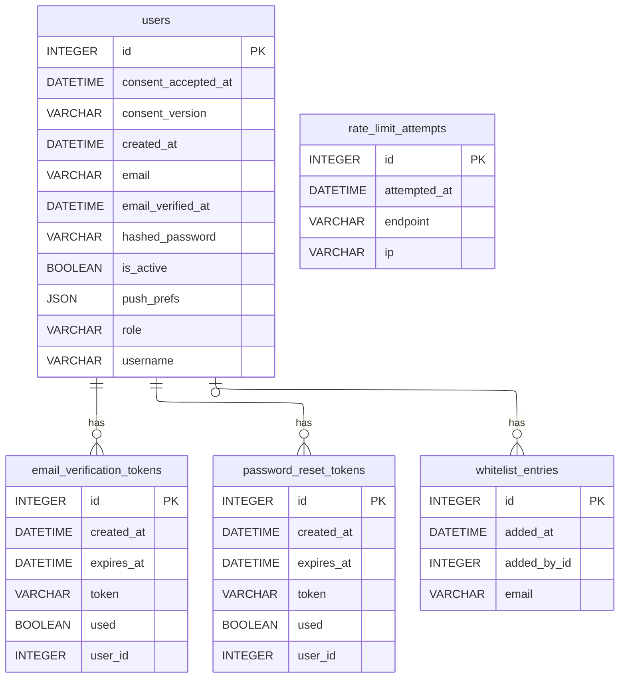

# Schéma — Utilisateurs & sécurité

Le compte utilisateur et tout ce qui gère son cycle de vie sécurité : vérification d'email, réinitialisation de mot de passe, rate limiting anti brute-force, whitelist d'inscription.

[⬅ Retour au schéma complet](../schema_bdd.md)

## Contraintes et règles invisibles sur le diagramme

- **`users.role`** est un `VARCHAR` en base mais un enum applicatif à 3 valeurs :
  `user`, `moderator`, `admin` (défaut `user`).
- **Whitelist d'inscription** (`is_email_allowed()`, `backend/app/config/whitelist.py`) :
  si la table `whitelist_entries` contient des entrées, seuls ces emails (ou domaines
  `@domaine.com`) peuvent s'inscrire ; sinon repli sur la variable d'env `ALLOWED_EMAILS` ;
  si aucune des deux n'est renseignée, l'inscription est ouverte à tous.
- **`users.is_active=False`** bloque la connexion (suspension de compte par un admin).
- **`waitlist_entries.status`** est un enum applicatif (`pending`/`invited`/`rejected`,
  défaut `pending`), `email` unique.
- **Droits d'administration** : un modérateur ne peut pas modifier son propre compte ;
  seul un `admin` peut changer un rôle ou supprimer un compte. Chaque action
  (suspension, changement de rôle, whitelist) est tracée dans `audit_logs`.
- **Tokens à usage unique** : `email_verification_tokens` et `password_reset_tokens`
  ont un flag `used` et une `expires_at` — ce sont des tables techniques à durée de
  vie courte, purgeables après expiration.
